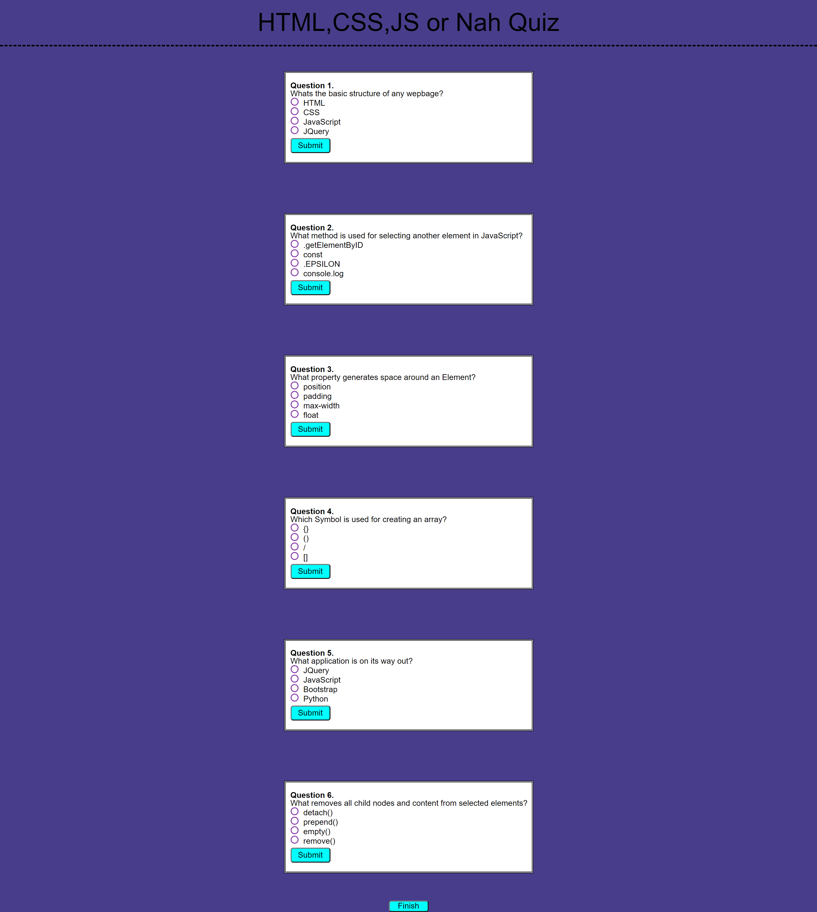
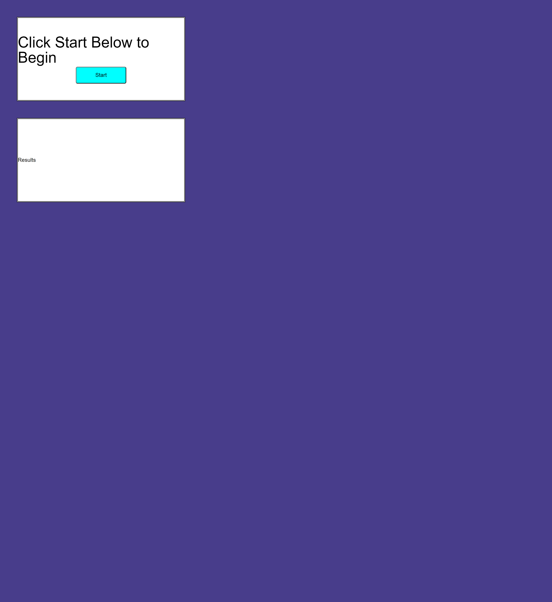

# MyWebAPI_Quiz

#Description

WebApiQuiz Challenge using JavaScript, HTML, and CSS

I needed to created a quiz application that used javascript that starts the quiz with an event listener. Based on the users choices for each question needed to be stored in local storage and move onto the next question by using functions and callbacks. While the user answers each question would have a timer for completing the quiz. Once the quiz is completed the user would see there results from local storage and there score. 

#Mock_UP

#Usage

Other users and developers can use this application to create more complex testing applications. A random generator for changing the order of the questions or the order of the answers themselves. This could also be used for a flash card or memory test aid for students or people study different areas of subjects.

#Credits

Github_Deploy-"https://ameridacas.github.io/MyWebAPI_Quiz/"

Github_Repo-"https://github.com/ameridacas/MyWebAPI_Quiz"